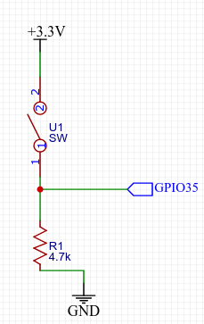

# Vibration sensor on ESP32

Detect vibration and send status through MQTT or UDP

## Hardware

* An ESP32 board, most variant will work
* A vibration switch, eg., SW-18010

## Connection

## Configuration

* Configure UDP server in `net.h`
* Configure MQTT broker in `mqtt.h`

## Configuration

Max. MQTT notification internal
